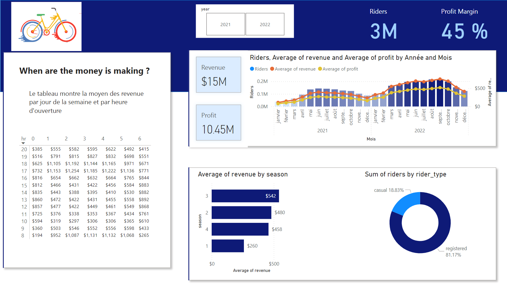
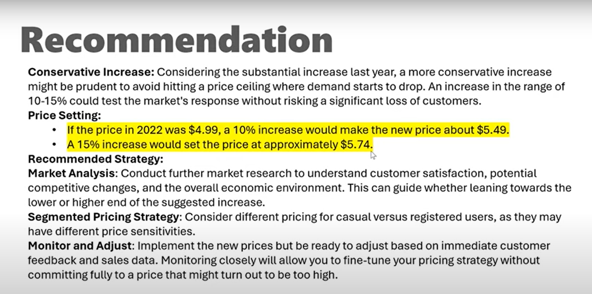

# Bike Share Data Analysis with Power BI

## Project Overview
This project focuses on analyzing bike-sharing data using SQL Server and Power BI to provide insights and recommendations based on data trends.

## Steps Involved

### 1. Build a Database with SQL Server
- **Description**: The first step was to create a SQL Server database to store the bike-sharing data.
- **Database Setup**: The files in the folder "main data source" were imported into the SQL Server database.
- **Tools Used**: SQL Server Management Studio (SSMS).

---

### 2. Develop SQL Queries
- **Description**: A series of SQL queries were developed to extract relevant information from the database.
- **Sample Queries**:
  ```sql
  with cte as (
    SELECT * From bike_share_yr_0
    union
    SELECT * FROM bike_share_yr_1)

    SELECT dteday,
        season,
        left.yr,
        weekday,
        hr,
        rider_type,
        riders,
        price,
        COGS,
        riders *  CONVERT(DECIMAL(10, 2), Price) as revenue,
        riders * CONVERT(DECIMAL(10, 2), Price) -  CONVERT(DECIMAL(10, 2), COGS) as profit
    FROM cte as left
    LEFT JOIN cost_table as right
    On left.yr = right.yr

---

### 3. Connect Power BI to Your Database
- **Description**: Power BI was used to connect directly to the SQL Server database to fetch data.
- **Connection Type**: DirectQuery was used to maintain a live connection with the database.

---

### 4. Build a Dashboard
- **Description**: A Power BI dashboard was built to visualize key metrics such as:
  - Total bike rentals over time.
  - Rentals based on weather conditions.
  - Hourly, daily, and monthly rental patterns.
- **Charts Used**: Line charts, bar charts, and pie charts were used for data visualization.

#### Image Placeholder:
> 

---

### 5. Make Analysis Recommendations
- **Description**: Based on the analysis, actionable recommendations were made to improve bike-sharing efficiency.
- **Insights Gained**:
  - Bike rentals increase significantly during weekends and favorable weather conditions.
  - Peak usage times are between 8 AM and 9 AM, and between 5 PM and 6 PM.

#### Image Placeholder:
> 

## Conclusion
This project demonstrates how to build an end-to-end data analysis pipeline using SQL Server and Power BI. The final recommendations can help stakeholders make data-driven decisions to optimize the bike-sharing service.

